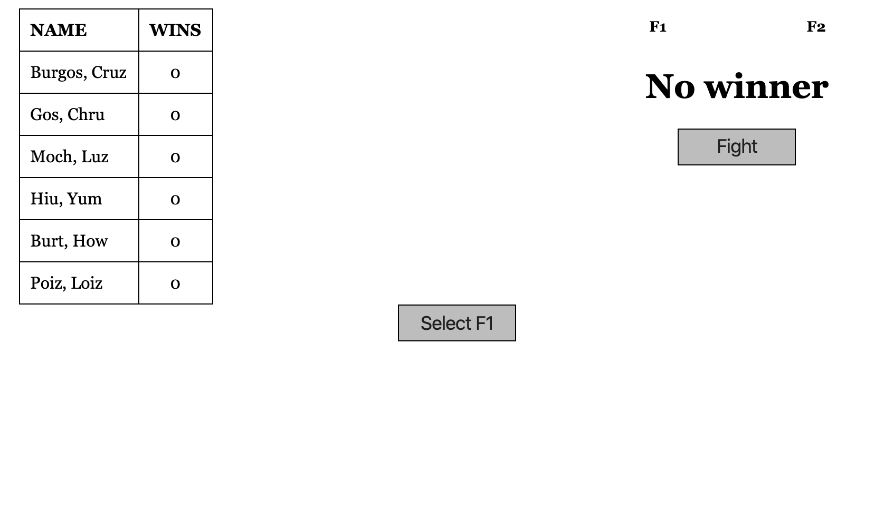
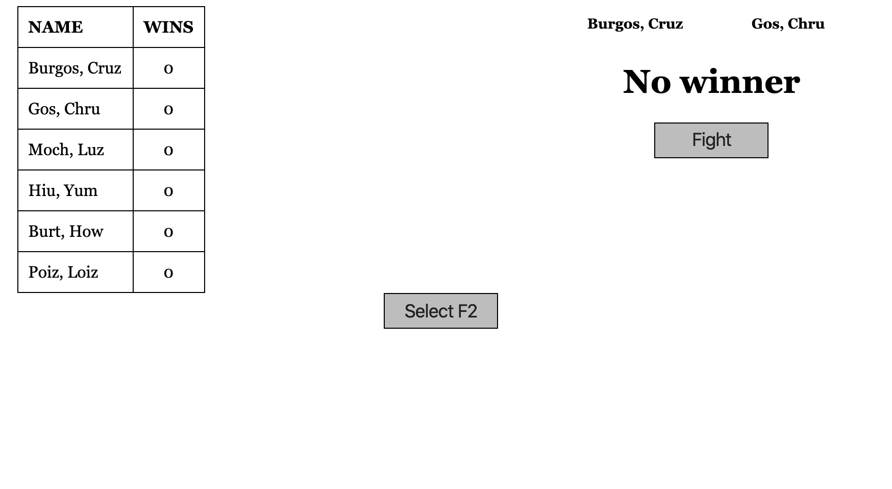
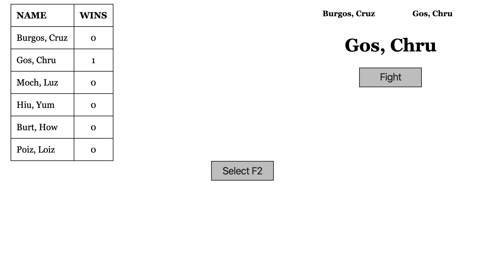
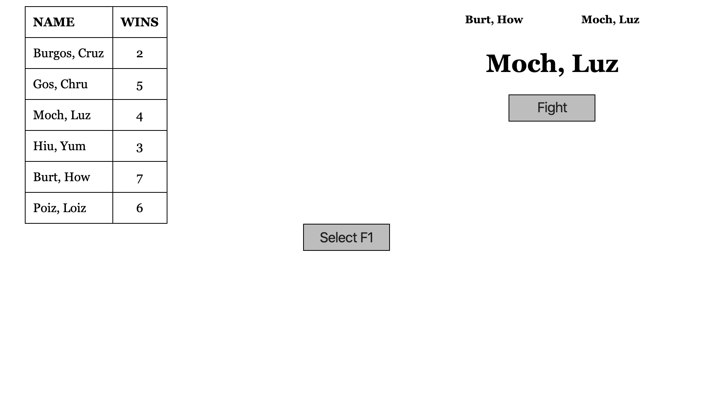

# React-fight-club
Created with CodeSandbox

On arrival.

You can selecting a fighter by clicking on the name. There is a toggle button to allow you to switch from fighter one and two

After selecting two fighters make them fight. Once a winner is selected a point is automatically given to the player

More fighting.

